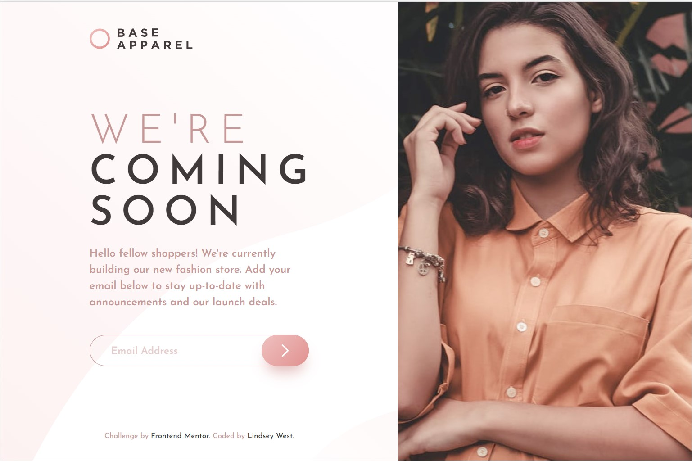

# Frontend Mentor - Base Apparel coming soon page solution

This is a solution to the [Base Apparel coming soon page challenge on Frontend Mentor](https://www.frontendmentor.io/challenges/base-apparel-coming-soon-page-5d46b47f8db8a7063f9331a0). Frontend Mentor challenges help you improve your coding skills by building realistic projects. 

## Table of contents

- [Overview](#overview)
  - [The challenge](#the-challenge)
  - [Screenshot](#screenshot)
  - [Links](#links)
- [My process](#my-process)
  - [Built with](#built-with)
  - [What I learned](#what-i-learned)
  - [Continued development](#continued-development)
  - [Useful resources](#useful-resources)
- [Author](#author)
- [Acknowledgments](#acknowledgments)

## Overview

### The challenge

Users should be able to:

- View the optimal layout for the site depending on their device's screen size
- See hover states for all interactive elements on the page
- Receive an error message when the `form` is submitted if:
  - The `input` field is empty
  - The email address is not formatted correctly

### Screenshot

### Links

- Solution URL: [Frontend Mentor Solution](https://www.frontendmentor.io/solutions/coming-soon-page-with-responsive-flex-and-grid-P6c_1rV6JT)
- Live Site URL: [Github Pages Site](https://lw3st.github.io/Base-Apparel-Coming-Soon/)

## My process

### Built with

- Semantic HTML5 markup
- CSS variables
- Sass
- CSS Grid
- Flexbox
- Component-based CSS
- Mobile-first workflow
- Screen-reader and keyboard accessibility testing

### What I learned

I learned that there are built-in ways to add and remove classes in JavaScript, rather than the += or replace('hidden', '') methods I was using before. Switching to these (at Julio's suggestion) made my code much easier to edit and troubleshoot. In CSS, I experimented with using the grid system on the desktop, but not the mobile, which made it a lot simpler to work with the hero image. It was also interesting to see how many ways forms can be validated, including through HTML, client-side validation with JavaScript, and validation that's done by the browser's built-in tools.

With this progress, I think I'm most proud of the transitions between mobile and desktop resolutions. I felt that they were much smoother than some of my previous projects.

### Continued development

I'd like to continue working with JavaScript and accessibility as they relate to HTML forms and learning more of JavaScripts' many methods options.

### Useful resources

- [CSS Grid Generator](https://cssgrid-generator.netlify.app/) - This grid generator made designing my CSS grid very easy.
- [MDN preventDefault()](https://developer.mozilla.org/en-US/docs/Web/API/Event/preventDefault) - The preventDefault() method made it so I could validate the user's input without the form being submitted, and without having to remove the submit type from the submit button.
- [MDN Client-side Form Validation](https://developer.mozilla.org/en-US/docs/Learn/Forms/Form_validation) - A great resource on how to validate client-side, without relying completely on the browser.

## Author

- GitHub - [Lindsey West](https://github.com/lw3st)
- Frontend Mentor - [@lw3st](https://www.frontendmentor.io/profile/lw3st)

## Acknowledgments

Thank you so much to the users Chamu and Julio on the Frontend Mentor Slack page, who gave me advice that helped me get my JavaScript up and running.
